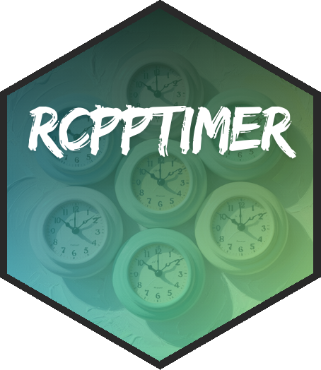

# rcpptimer <a href="https://rcpptimer.berrisch.biz"></a>

<!-- badges: start -->
[](https://cran.r-project.org/package=rcpptimer)
[](https://github.com/BerriJ/rcpptimer/blob/dev/.github/workflows/R-CMD-check-main.yaml)
[](https://app.codecov.io/gh/berrij/rcpptimer?branch=main)
<!-- badges: end -->

## Overview

This R Package provides Rcpp bindings for [cpptimer](https://github.com/BerriJ/cpptimer), a simple tic-toc class for timing C++ code. It's not just simple, it's blazing fast! This sleek tic-toc timer class supports nested and overlapping timers and OpenMP parallelism. It boasts a nanosecond-level time resolution. Results (with summary statistics) are automatically passed back to R as a `data.frame.`

## Install

Install rcpptimer from CRAN.

```
install.packages("rcpptimer")
```

## Basic Usage with Rcpp::cppFunction

Here is a straightforward example of using the `Rcpp::Timer` with Rcpp::cppFunction:

```r
Rcpp::cppFunction("
double demo_rnorm()
{
  Rcpp::Timer timer;
  timer.tic();
  double x = rnorm(1, 1)[0];
  timer.toc();
  return(x);
}",
  depends = "rcpptimer"
)

demo_rnorm()
```

The timer object will automatically write its result to the R environment:

```r
print(times)
       Microseconds SD   Min   Max Count
tictoc        3.972  0 3.972 3.972     1
```

Check out the [Documentation](https://rcpptimer.berrisch.biz/articles/rcpptimer.html) for:

- Setting up multiple, nested, and overlapping timers
- Using OpenMP parallelism
- Using rcpptimer with `Rcpp::sourceCpp`
- Adding rcpptimer to your package

## Limitations

Processes taking less than a nanosecond cannot be timed.

Unmatched `.tic()` and `.toc()` calls do not raise errors at compile time. However, they throw warnings at runtime.

## Acknowledgments

This package (and the underlying [cpptimer](https://github.com/BerriJ/cpptimer) class) was inspired by [zdebruine](https://github.com/zdebruine)'s [RcppClock](https://github.com/zdebruine/RcppClock). I used that package a lot and wanted to add OpenMP support, alter the process of calculating summary statistics, and apply a series of other adjustments. I hope you find it useful.